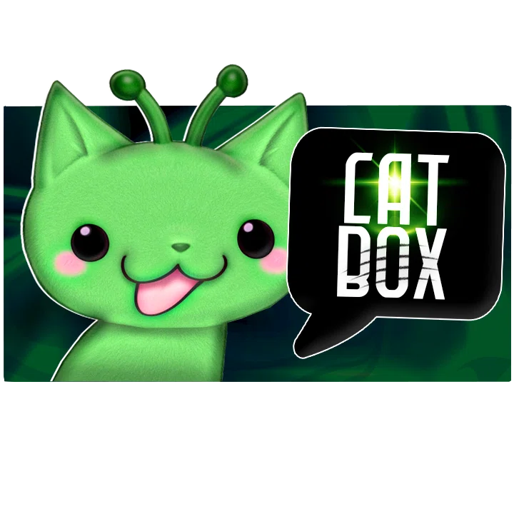

<div align="center">



# CATBox

**Retro Dialogue Framework**

[](https://www.minecraft.net/)
[](https://neoforged.net/)
[](https://github.com/EsparragoCAT/CATBox/actions/workflows/build.yml)
[](LICENSE)

Mod para **NeoForge 1.21.1** que añade cuadros de diálogo animados estilo retro.
Hecho por **EsparragoCAT**.

</div>

---

## ✨ Funciones

- **Diálogos por comando**: muestra una caja de diálogo con hablante, texto animado letra a letra, sonido, icono y color.
- **Area chat**: con `/textbox area chat true`, **tus** mensajes del chat se convierten en textbox para los jugadores cercanos (radio configurable). Solo afecta a quien lo activa.
- **Configuración personal**: cada jugador personaliza su textbox de área (nombre, color, sonido, icono, textura de caja, posición, tiempo, tamaño y radio).
- **Iconos flexibles**: ítem de Minecraft, cabeza de jugador (`@nombre`) o imagen por URL.
- **Textura de caja personalizada**: fondo 9-slice cargado por URL.
- **Teclas configurables** desde el menú *Controles*.

## 📥 Instalación

1. Instala **NeoForge** para **Minecraft 1.21.1**.
2. Copia el `.jar` del mod en la carpeta `mods/` (cliente y servidor).

## 🎮 Comandos

```
/textbox <jugadores> <hablante> <texto> <sonido> <icono> <posición> <segundos> <bloqueante> [tamaño]
```

Ejemplo:

```
/textbox @a Steve Hola minecraft:block.note_block.hat @Steve bottom 3 false 80
```

Activar/desactivar tu area chat (solo operador):

```
/textbox area chat true|false
```

## ⌨️ Teclas

| Tecla | Acción |
|---|---|
| `V` | Saltar la animación del texto. |
| `B` | Abrir la configuración de tu textbox de área. |

## 🎨 Colores

En el hablante o el texto puedes usar:

- `&#RRGGBB` (hexadecimal), por ejemplo `&#FFAA00`.
- Códigos de Minecraft como `&c` (rojo), `&a` (verde), etc.

El color del borde se toma del color del hablante.

## ⚙️ Configuración

La configuración personal se guarda en:

```
config/textbox-area.json
```

Se edita cómodamente desde la interfaz (tecla `B`).

## 📚 Documentación

- [Manual de usuario completo](docs/MANUAL.md)
- [Especificación de textura de caja](docs/BOX_TEXTURE_SPEC.md)
- [Plantilla de textura](docs/box_texture_template.png)

## 🔐 Permisos

Nodo de permiso: `textbox.area` (por defecto: operadores, nivel 2).

```
/lp group <grupo> permission set textbox.area true
```

## 📄 Licencia

Este proyecto está bajo la licencia **MIT**. Ver [LICENSE](LICENSE).
